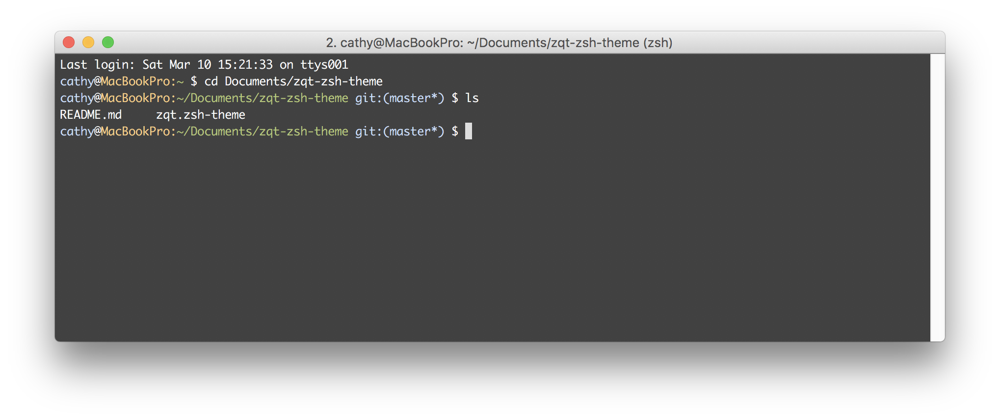

## Zqt ZSH Theme
Modified from oh-my-zsh builtin theme _maran.zsh-theme_
- Shortened localhost name
- Replaced home directory with `~` shorthand in current directory

### Screenshot

### Installation
1. Copy `zqt.zsh-them` to `~/.oh-my-zsh/themes/`
2. Edit zsh configuratin file `~/.zshrc`, set `ZSH_THEME=zqt`
3. Restart your shell environment

